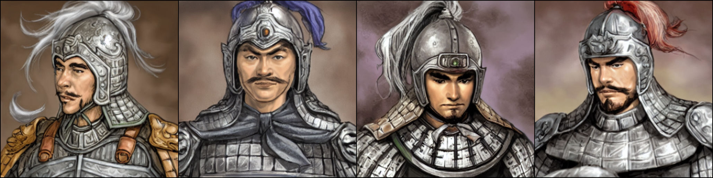

__Stable Diffusion fine tuned on Romance of the Three Kingdoms XI: Officer Portraits (https://kongming.net/11/portraits/).__

Put in a text prompt and generate your own Officier in Three Kingdoms.

trained using this [script](https://github.com/LambdaLabsML/examples/tree/main/stable-diffusion-finetuning) with this [dataset](https://huggingface.co/datasets/wx44wx/three-kingdoms-blip-captions).



try in [colab](https://colab.research.google.com/drive/1Wu_V-beDvLltrP4t6QURbb_8UDYYcUSC).

## Usage

```bash
!pip install diffusers==0.19.3
!pip install transformers scipy ftfy
```

```python
import torch
from diffusers import StableDiffusionPipeline
from torch import autocast

pipe = StableDiffusionPipeline.from_pretrained("wx44wx/sd-three-kingdoms-diffusers", torch_dtype=torch.float16)  
pipe = pipe.to("cuda")

prompt = "a man in armor"
scale = 3
n_samples = 4

# Sometimes the nsfw checker is confused by the Pokémon images, you can disable
# it at your own risk here
disable_safety = False

if disable_safety:
  def null_safety(images, **kwargs):
      return images, False
  pipe.safety_checker = null_safety

with autocast("cuda"):
  images = pipe(n_samples*[prompt], guidance_scale=scale).images

for idx, im in enumerate(images):
  im.save(f"{idx:06}.png")
```

## Model description

Trained on [BLIP captioned Three Kingdoms Officers images](https://huggingface.co/datasets/wx44wx/three-kingdoms-blip-captions) using 1xA6000 GPUs for around 16,000 steps.

## Links

- [Lambda Diffusers](https://github.com/LambdaLabsML/lambda-diffusers)
- [Captioned Three Kingdoms dataset](https://huggingface.co/datasets/wx44wx/three-kingdoms-blip-captions)
- [Model weights in Diffusers format](https://huggingface.co/wx44wx/sd-three-kingdoms-diffusers)
- [Original model weights](https://huggingface.co/wx44wx/three-kingdoms-stable-diffusion)
- [Training code](https://github.com/justinpinkney/stable-diffusion)

Trained by [Xin Wang](wangxin93.github.io).